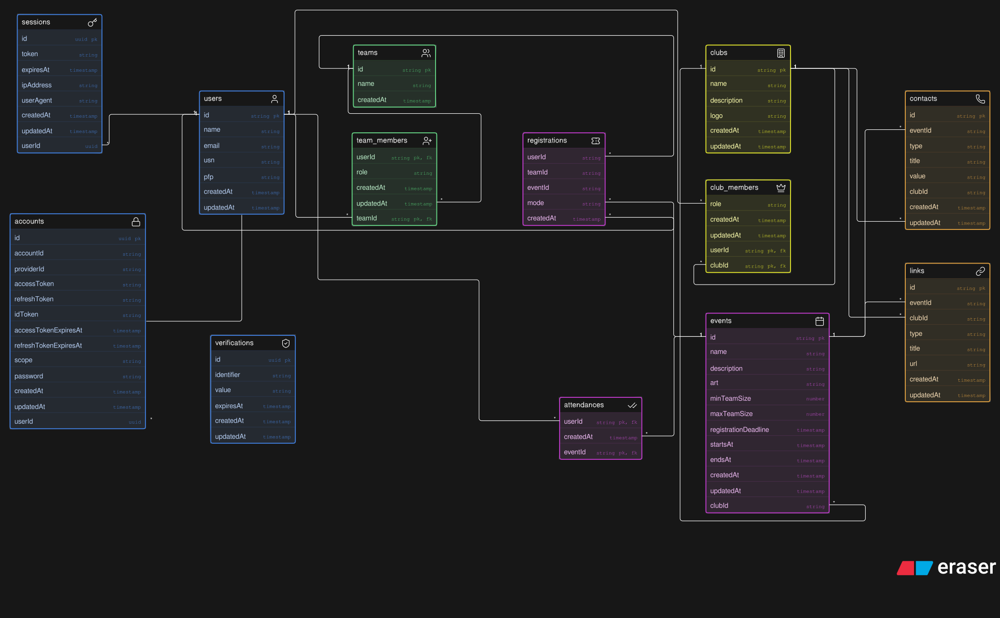

# Database Documentation

## Entity Relationship Diagram (ERD)



> [!NOTE]
> The `ERD.svg` diagram above is currently outdated and will be updated to reflect the latest database migrations (Migration 004 & BaaS extension tables). Please refer to the **Eraser Code (DBML)** snippet below or the **Tables Explanation** section for the up-to-date schema definitions.

<details>
<summary>Eraser Code</summary>

```dbml
users [icon: user, color: blue] {
  id string pk
  name string
  email string
  emailVerified boolean
  image string
  usn string
  slug string
  systemRole string
  createdAt timestamp
  updatedAt timestamp
}

sessions [icon: key, color: blue] {
  id string pk
  userId string
  token string
  expiresAt timestamp
  ipAddress string
  userAgent string
  createdAt timestamp
  updatedAt timestamp
}

accounts [icon: lock, color: blue] {
  id string pk
  userId string
  accountId string
  providerId string
  accessToken string
  refreshToken string
  idToken string
  accessTokenExpiresAt timestamp
  refreshTokenExpiresAt timestamp
  scope string
  password string
  createdAt timestamp
  updatedAt timestamp
}

verifications [icon: shield-check, color: blue] {
  id string pk
  identifier string
  value string
  expiresAt timestamp
  createdAt timestamp
  updatedAt timestamp
}

clubs [icon: building-2, color: yellow] {
  id string pk
  name string
  description string
  logo string
  slug string
  status string
  createdAt timestamp
  updatedAt timestamp
}

club_members [icon: crown, color: yellow] {
  clubId string pk, fk
  userId string pk, fk
  role string
  createdAt timestamp
  updatedAt timestamp
}

teams [icon: users, color: green] {
  id string pk
  name string
  createdAt timestamp
  updatedAt timestamp
}

team_members [icon: user-plus, color: green] {
  teamId string pk, fk
  userId string pk, fk
  role string
  createdAt timestamp
  updatedAt timestamp
}

events [icon: calendar, color: purple] {
  id string pk
  name string
  description string
  art string
  slug string
  clubId string
  minTeamSize number
  maxTeamSize number
  registrationDeadline timestamp
  startsAt timestamp
  endsAt timestamp
  isPaid boolean
  feeAmount number
  upiId string
  upiQrUrl string
  createdAt timestamp
  updatedAt timestamp
}

registrations [icon: ticket, color: purple] {
  id string pk
  eventId string
  userId string
  teamId string
  mode string
  status string
  paymentProofUrl string
  transactionId string
  rejectionReason string
  verifiedBy string
  verifiedAt timestamp
  createdAt timestamp
}

attendances [icon: check-check, color: purple] {
  userId string pk, fk
  eventId string pk, fk
  createdAt timestamp
}

contacts [icon: phone, color: orange] {
  id string pk
  type string
  title string
  value string
  clubId string
  eventId string
  createdAt timestamp
  updatedAt timestamp
}

links [icon: link, color: orange] {
  id string pk
  type string
  title string
  url string
  clubId string
  eventId string
  createdAt timestamp
  updatedAt timestamp
}

club_applications [icon: file-text, color: yellow] {
  id string pk
  applicantId string
  name string
  slug string
  category string
  description string
  logo string
  contactEmail string
  contactPhone string
  status string
  rejectionReason string
  reviewedBy string
  reviewedAt timestamp
  createdAt timestamp
  updatedAt timestamp
}

club_roles [icon: shield, color: yellow] {
  id string pk
  clubId string
  name string
  color string
  rank number
  permissions jsonb
  createdAt timestamp
  updatedAt timestamp
}

club_member_roles [icon: user-check, color: yellow] {
  clubId string pk, fk
  userId string pk, fk
  roleId string pk, fk
}

club_api_keys [icon: key-round, color: red] {
  id string pk
  clubId string
  name string
  keyPrefix string
  keyHash string
  allowedOrigins jsonb
  rateLimitPerMin number
  lastUsedAt timestamp
  expiresAt timestamp
  createdAt timestamp
}

// Relationships
registrations.userId > users.id
registrations.teamId > teams.id
registrations.eventId > events.id
registrations.verifiedBy > users.id
attendances.userId > users.id
attendances.eventId > events.id
events.clubId > clubs.id

links.clubId > clubs.id
links.eventId > events.id
contacts.clubId > clubs.id
contacts.eventId > events.id

club_members.clubId > clubs.id
club_members.userId > users.id

team_members.teamId > teams.id
team_members.userId > users.id

club_applications.applicantId > users.id
club_applications.reviewedBy > users.id
club_roles.clubId > clubs.id
club_member_roles.clubId > clubs.id
club_member_roles.userId > users.id
club_member_roles.roleId > club_roles.id
club_api_keys.clubId > clubs.id

sessions.userId > users.id
accounts.userId > users.id
```

</details>

---

## Tables Explanation

### 1. `users`

Stores user profile information, authentication credentials, academic details, and unique profile slugs.

| Column           | Type          | Constraints        | Description                         |
| :--------------- | :------------ | :----------------- | :---------------------------------- |
| `id`             | `UUID`        | `PRIMARY KEY`      | Unique user identifier              |
| `name`           | `TEXT`        | `NOT NULL`         | Full name of the user               |
| `email`          | `TEXT`        | `NOT NULL, UNIQUE` | Email address                       |
| `email_verified` | `BOOLEAN`     | `NOT NULL`         | Whether email is verified           |
| `image`          | `TEXT`        | `NULLABLE`         | Profile image URL                   |
| `usn`            | `TEXT`        | `NULLABLE`         | University seat number / student ID |
| `slug`           | `TEXT`        | `NOT NULL, UNIQUE` | Unique URL-friendly profile slug    |
| `system_role`    | `TEXT`        | `NOT NULL`         | System role (`USER`, `SUPER_ADMIN`) |
| `created_at`     | `TIMESTAMPTZ` | `NOT NULL`         | Creation timestamp                  |
| `updated_at`     | `TIMESTAMPTZ` | `NOT NULL`         | Last update timestamp               |

---

### 2. `sessions`

Stores active session tokens for user authentication state management.

| Column       | Type          | Constraints                 | Description                  |
| :----------- | :------------ | :-------------------------- | :--------------------------- |
| `id`         | `UUID`        | `PRIMARY KEY`               | Unique session ID            |
| `user_id`    | `UUID`        | `NOT NULL, FK -> users(id)` | Foreign key to `users` table |
| `token`      | `TEXT`        | `NOT NULL, UNIQUE`          | Session token string         |
| `expires_at` | `TIMESTAMPTZ` | `NOT NULL`                  | Session expiry timestamp     |
| `ip_address` | `TEXT`        | `NULLABLE`                  | Client IP address            |
| `user_agent` | `TEXT`        | `NULLABLE`                  | Client browser user agent    |
| `created_at` | `TIMESTAMPTZ` | `NOT NULL`                  | Session creation timestamp   |
| `updated_at` | `TIMESTAMPTZ` | `NOT NULL`                  | Session update timestamp     |

---

### 3. `accounts`

Stores linked external authentication providers (e.g. OAuth providers or password credentials).

| Column                     | Type          | Constraints                 | Description                  |
| :------------------------- | :------------ | :-------------------------- | :--------------------------- |
| `id`                       | `UUID`        | `PRIMARY KEY`               | Unique account ID            |
| `user_id`                  | `UUID`        | `NOT NULL, FK -> users(id)` | Foreign key to `users` table |
| `account_id`               | `TEXT`        | `NOT NULL`                  | External provider user ID    |
| `provider_id`              | `TEXT`        | `NOT NULL`                  | Authentication provider name |
| `access_token`             | `TEXT`        | `NULLABLE`                  | Provider access token        |
| `refresh_token`            | `TEXT`        | `NULLABLE`                  | Provider refresh token       |
| `id_token`                 | `TEXT`        | `NULLABLE`                  | OpenID Connect ID token      |
| `access_token_expires_at`  | `TIMESTAMPTZ` | `NULLABLE`                  | Access token expiry          |
| `refresh_token_expires_at` | `TIMESTAMPTZ` | `NULLABLE`                  | Refresh token expiry         |
| `scope`                    | `TEXT`        | `NULLABLE`                  | OAuth scopes                 |
| `password`                 | `TEXT`        | `NULLABLE`                  | Hashed password string       |
| `created_at`               | `TIMESTAMPTZ` | `NOT NULL`                  | Creation timestamp           |
| `updated_at`               | `TIMESTAMPTZ` | `NOT NULL`                  | Update timestamp             |

---

### 4. `verifications`

Stores temporary token verification records for authentication actions such as email verification and password resets.

| Column       | Type          | Constraints   | Description                               |
| :----------- | :------------ | :------------ | :---------------------------------------- |
| `id`         | `UUID`        | `PRIMARY KEY` | Unique verification record ID             |
| `identifier` | `TEXT`        | `NOT NULL`    | Verification target (e.g., email address) |
| `value`      | `TEXT`        | `NOT NULL`    | Verification code or token value          |
| `expires_at` | `TIMESTAMPTZ` | `NOT NULL`    | Token expiration timestamp                |
| `created_at` | `TIMESTAMPTZ` | `NOT NULL`    | Record creation timestamp                 |
| `updated_at` | `TIMESTAMPTZ` | `NOT NULL`    | Record update timestamp                   |

---

### 5. `clubs`

Stores club profiles, descriptions, logo assets, and custom URL slugs.

| Column        | Type          | Constraints        | Description                             |
| :------------ | :------------ | :----------------- | :-------------------------------------- |
| `id`          | `UUID`        | `PRIMARY KEY`      | Unique club ID                          |
| `name`        | `TEXT`        | `NOT NULL`         | Club name                               |
| `description` | `TEXT`        | `NOT NULL`         | Description of the club                 |
| `logo`        | `TEXT`        | `NULLABLE`         | Club logo image URL                     |
| `slug`        | `TEXT`        | `NOT NULL, UNIQUE` | Unique URL-friendly club slug           |
| `status`      | `TEXT`        | `NOT NULL`         | Club status (`ACTIVE`, `PENDING`, etc.) |
| `created_at`  | `TIMESTAMPTZ` | `NOT NULL`         | Creation timestamp                      |
| `updated_at`  | `TIMESTAMPTZ` | `NOT NULL`         | Last update timestamp                   |

---

### 6. `club_members`

Junction table linking users to clubs and defining user roles within each club.

| Column       | Type          | Constraints                    | Description                   |
| :----------- | :------------ | :----------------------------- | :---------------------------- |
| `club_id`    | `UUID`        | `PRIMARY KEY, FK -> clubs(id)` | Foreign key to `clubs` table  |
| `user_id`    | `UUID`        | `PRIMARY KEY, FK -> users(id)` | Foreign key to `users` table  |
| `role`       | `TEXT`        | `NOT NULL`                     | Member role within the club   |
| `created_at` | `TIMESTAMPTZ` | `NOT NULL`                     | Membership creation timestamp |
| `updated_at` | `TIMESTAMPTZ` | `NOT NULL`                     | Record update timestamp       |

---

### 7. `teams`

Stores teams created by users for team-based event registrations.

| Column       | Type          | Constraints   | Description           |
| :----------- | :------------ | :------------ | :-------------------- |
| `id`         | `UUID`        | `PRIMARY KEY` | Unique team ID        |
| `name`       | `TEXT`        | `NOT NULL`    | Team name             |
| `created_at` | `TIMESTAMPTZ` | `NOT NULL`    | Creation timestamp    |
| `updated_at` | `TIMESTAMPTZ` | `NOT NULL`    | Last update timestamp |

---

### 8. `team_members`

Junction table mapping users to teams along with their team role.

| Column       | Type          | Constraints                    | Description                  |
| :----------- | :------------ | :----------------------------- | :--------------------------- |
| `team_id`    | `UUID`        | `PRIMARY KEY, FK -> teams(id)` | Foreign key to `teams` table |
| `user_id`    | `UUID`        | `PRIMARY KEY, FK -> users(id)` | Foreign key to `users` table |
| `role`       | `TEXT`        | `NOT NULL`                     | Role within the team         |
| `created_at` | `TIMESTAMPTZ` | `NOT NULL`                     | Join timestamp               |
| `updated_at` | `TIMESTAMPTZ` | `NOT NULL`                     | Last update timestamp        |

---

### 9. `events`

Stores details for events hosted by clubs, including team size requirements and deadlines.

| Column                  | Type            | Constraints                 | Description                          |
| :---------------------- | :-------------- | :-------------------------- | :----------------------------------- |
| `id`                    | `UUID`          | `PRIMARY KEY`               | Unique event ID                      |
| `name`                  | `TEXT`          | `NOT NULL`                  | Event title                          |
| `description`           | `TEXT`          | `NOT NULL`                  | Detailed event description           |
| `art`                   | `TEXT`          | `NULLABLE`                  | Cover art/banner image URL           |
| `slug`                  | `TEXT`          | `NOT NULL, UNIQUE`          | Unique event URL slug                |
| `club_id`               | `UUID`          | `NOT NULL, FK -> clubs(id)` | Foreign key to hosting `clubs` table |
| `min_team_size`         | `SMALLINT`      | `NOT NULL`                  | Minimum allowed team size            |
| `max_team_size`         | `SMALLINT`      | `NOT NULL`                  | Maximum allowed team size            |
| `registration_deadline` | `TIMESTAMPTZ`   | `NOT NULL`                  | Deadline for event registration      |
| `starts_at`             | `TIMESTAMPTZ`   | `NOT NULL`                  | Event start date/time                |
| `ends_at`               | `TIMESTAMPTZ`   | `NOT NULL`                  | Event end date/time                  |
| `is_paid`               | `BOOLEAN`       | `NOT NULL`                  | Whether event registration requires payment |
| `fee_amount`            | `NUMERIC(10,2)` | `NULLABLE`                  | Registration fee amount              |
| `upi_id`                | `TEXT`          | `NULLABLE`                  | Host UPI ID for payment transfer     |
| `upi_qr_url`            | `TEXT`          | `NULLABLE`                  | Payment QR code image URL            |
| `created_at`            | `TIMESTAMPTZ`   | `NOT NULL`                  | Creation timestamp                   |
| `updated_at`            | `TIMESTAMPTZ`   | `NOT NULL`                  | Last update timestamp                |

---

### 10. `registrations`

Stores registrations for events, supporting individual (`user_id`) or team (`team_id`) entries.

| Column               | Type          | Constraints                  | Description                                            |
| :------------------- | :------------ | :--------------------------- | :----------------------------------------------------- |
| `id`                 | `UUID`        | `PRIMARY KEY`                | Unique registration ID                                 |
| `event_id`           | `UUID`        | `NOT NULL, FK -> events(id)` | Foreign key to `events` table                          |
| `user_id`            | `UUID`        | `NULLABLE, FK -> users(id)`  | Foreign key to `users` table (for solo mode)           |
| `team_id`            | `UUID`        | `NULLABLE, FK -> teams(id)`  | Foreign key to `teams` table (for team mode)           |
| `mode`               | `TEXT`        | `NOT NULL`                   | Registration mode ('SOLO' or 'TEAM')                   |
| `status`             | `TEXT`        | `NOT NULL`                   | Status ('CONFIRMED', 'PENDING', 'REJECTED')            |
| `payment_proof_url`  | `TEXT`        | `NULLABLE`                   | Uploaded payment proof image/document URL              |
| `transaction_id`     | `TEXT`        | `NULLABLE`                   | Payment transaction ID / reference number              |
| `rejection_reason`   | `TEXT`        | `NULLABLE`                   | Reason provided if payment verification failed         |
| `verified_by`        | `UUID`        | `NULLABLE, FK -> users(id)`  | Admin user who verified/rejected the payment           |
| `verified_at`        | `TIMESTAMPTZ` | `NULLABLE`                   | Timestamp when payment was verified                    |
| `created_at`         | `TIMESTAMPTZ` | `NOT NULL`                   | Registration timestamp                                 |

---

### 11. `attendances`

Tracks physical or virtual check-in attendance of users at events.

| Column       | Type          | Constraints                     | Description                   |
| :----------- | :------------ | :------------------------------ | :---------------------------- |
| `event_id`   | `UUID`        | `PRIMARY KEY, FK -> events(id)` | Foreign key to `events` table |
| `user_id`    | `UUID`        | `PRIMARY KEY, FK -> users(id)`  | Foreign key to `users` table  |
| `created_at` | `TIMESTAMPTZ` | `NOT NULL`                      | Check-in timestamp            |

---

### 12. `contacts`

Stores contact information linked to either a club or an event.

| Column       | Type          | Constraints                  | Description                               |
| :----------- | :------------ | :--------------------------- | :---------------------------------------- |
| `id`         | `UUID`        | `PRIMARY KEY`                | Unique contact ID                         |
| `type`       | `TEXT`        | `NOT NULL`                   | Contact channel type (e.g., EMAIL, PHONE) |
| `title`      | `TEXT`        | `NOT NULL`                   | Title/label for the contact               |
| `value`      | `TEXT`        | `NOT NULL`                   | Contact information value                 |
| `event_id`   | `UUID`        | `NULLABLE, FK -> events(id)` | Associated event ID                       |
| `club_id`    | `UUID`        | `NULLABLE, FK -> clubs(id)`  | Associated club ID                        |
| `created_at` | `TIMESTAMPTZ` | `NOT NULL`                   | Creation timestamp                        |
| `updated_at` | `TIMESTAMPTZ` | `NOT NULL`                   | Last update timestamp                     |

---

### 13. `links`

Stores external links and resource URLs associated with a club or an event.

| Column       | Type          | Constraints                  | Description                      |
| :----------- | :------------ | :--------------------------- | :------------------------------- |
| `id`         | `UUID`        | `PRIMARY KEY`                | Unique link ID                   |
| `type`       | `TEXT`        | `NOT NULL`                   | Link type (e.g., WEBSITE, RULES) |
| `title`      | `TEXT`        | `NOT NULL`                   | Display title for the link       |
| `url`        | `TEXT`        | `NOT NULL`                   | Destination URL                  |
| `event_id`   | `UUID`        | `NULLABLE, FK -> events(id)` | Associated event ID              |
| `club_id`    | `UUID`        | `NULLABLE, FK -> clubs(id)`  | Associated club ID               |
| `created_at` | `TIMESTAMPTZ` | `NOT NULL`                   | Creation timestamp               |
| `updated_at` | `TIMESTAMPTZ` | `NOT NULL`                   | Last update timestamp            |

---

### 14. `club_applications`

Stores club creation applications submitted by users for Super Admin review.

| Column             | Type          | Constraints                 | Description                                      |
| :----------------- | :------------ | :-------------------------- | :----------------------------------------------- |
| `id`               | `UUID`        | `PRIMARY KEY`               | Unique application ID                            |
| `applicant_id`     | `UUID`        | `NOT NULL, FK -> users(id)` | Foreign key to `users` table (applicant)         |
| `name`             | `TEXT`        | `NOT NULL`                  | Proposed club name                               |
| `slug`             | `TEXT`        | `NOT NULL, UNIQUE`          | Proposed URL slug                                |
| `category`         | `TEXT`        | `NOT NULL`                  | Club category                                    |
| `description`      | `TEXT`        | `NOT NULL`                  | Application description                          |
| `logo`             | `TEXT`        | `NULLABLE`                  | Club logo asset URL                              |
| `contact_email`    | `TEXT`        | `NOT NULL`                  | Contact email for application                    |
| `contact_phone`    | `TEXT`        | `NULLABLE`                  | Contact phone number                             |
| `status`           | `TEXT`        | `NOT NULL`                  | Application status (`PENDING`, `APPROVED`, etc.) |
| `rejection_reason` | `TEXT`        | `NULLABLE`                  | Reason if application was rejected               |
| `reviewed_by`      | `UUID`        | `NULLABLE, FK -> users(id)` | Admin user who reviewed application              |
| `reviewed_at`      | `TIMESTAMPTZ` | `NULLABLE`                  | Review timestamp                                 |
| `created_at`       | `TIMESTAMPTZ` | `NOT NULL`                  | Application submission timestamp                 |
| `updated_at`       | `TIMESTAMPTZ` | `NOT NULL`                  | Application update timestamp                     |

---

### 15. `club_roles`

Stores dynamic Discord-style custom roles created within clubs.

| Column        | Type          | Constraints                                   | Description                  |
| :------------ | :------------ | :-------------------------------------------- | :--------------------------- |
| `id`          | `UUID`        | `PRIMARY KEY`                                 | Unique role ID               |
| `club_id`     | `UUID`        | `NOT NULL, FK -> clubs(id) ON DELETE CASCADE` | Associated club ID           |
| `name`        | `TEXT`        | `NOT NULL`                                    | Role name                    |
| `color`       | `TEXT`        | `NOT NULL`                                    | Display color (hex code)     |
| `rank`        | `INT`         | `NOT NULL`                                    | Role hierarchy rank          |
| `permissions` | `JSONB`       | `NOT NULL`                                    | Array of granted permissions |
| `created_at`  | `TIMESTAMPTZ` | `NOT NULL`                                    | Creation timestamp           |
| `updated_at`  | `TIMESTAMPTZ` | `NOT NULL`                                    | Last update timestamp        |

---

### 16. `club_member_roles`

Junction table mapping users to custom club roles.

| Column    | Type   | Constraints                                           | Description        |
| :-------- | :----- | :---------------------------------------------------- | :----------------- |
| `club_id` | `UUID` | `PRIMARY KEY, FK -> clubs(id) ON DELETE CASCADE`      | Associated club ID |
| `user_id` | `UUID` | `PRIMARY KEY, FK -> users(id) ON DELETE CASCADE`      | Associated user ID |
| `role_id` | `UUID` | `PRIMARY KEY, FK -> club_roles(id) ON DELETE CASCADE` | Assigned role ID   |

---

### 17. `club_api_keys`

Stores Headless BaaS API keys with CORS controls and rate limiting.

| Column               | Type          | Constraints                                   | Description                   |
| :------------------- | :------------ | :-------------------------------------------- | :---------------------------- |
| `id`                 | `UUID`        | `PRIMARY KEY`                                 | Unique API key ID             |
| `club_id`            | `UUID`        | `NOT NULL, FK -> clubs(id) ON DELETE CASCADE` | Associated club ID            |
| `name`               | `TEXT`        | `NOT NULL`                                    | Key name/description          |
| `key_prefix`         | `TEXT`        | `NOT NULL`                                    | Key prefix for identification |
| `key_hash`           | `TEXT`        | `NOT NULL, UNIQUE`                            | SHA-256 hashed key secret     |
| `allowed_origins`    | `JSONB`       | `NOT NULL`                                    | Array of allowed CORS origins |
| `rate_limit_per_min` | `INT`         | `NOT NULL`                                    | Requests allowed per minute   |
| `last_used_at`       | `TIMESTAMPTZ` | `NULLABLE`                                    | Last request timestamp        |
| `expires_at`         | `TIMESTAMPTZ` | `NULLABLE`                                    | Expiration timestamp          |
| `created_at`         | `TIMESTAMPTZ` | `NOT NULL`                                    | Key creation timestamp        |
